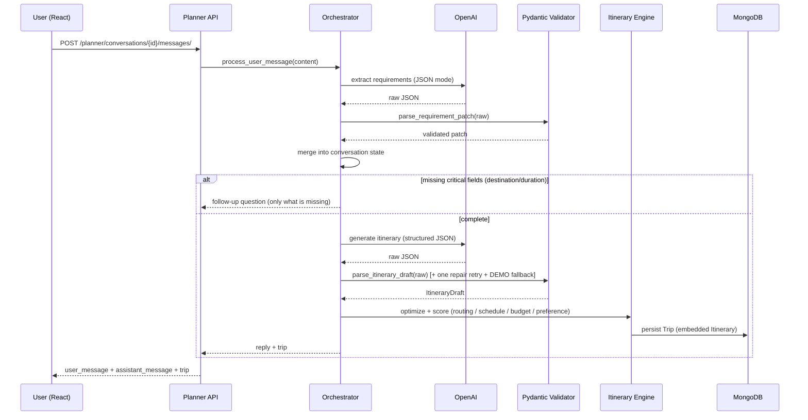
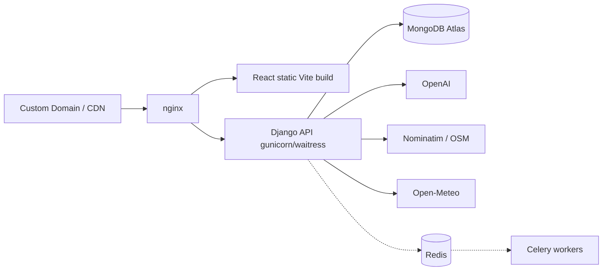

# WanderSync — System Architecture

## Overview

WanderSync is a premium, generative-AI travel planning platform. A React +
TypeScript single-page application talks to a **Django REST Framework** API over
HTTPS. All business logic — AI orchestration, itinerary optimization, sharing,
exports, personalization and authorization — lives server-side in Django.
**MongoDB** is the primary datastore (accessed via MongoEngine); **OpenAI** and
travel-data providers (Nominatim/OSM, Open-Meteo) are integrated behind a
swappable `TravelProvider` abstraction, never called directly from the browser.

## Technology Stack

| Layer       | Technology                                                                 |
|-------------|----------------------------------------------------------------------------|
| Frontend    | React 19 · TypeScript · Vite · Tailwind CSS v4 · Framer Motion · TanStack Query · RHF + Zod |
| Backend     | Python 3.12 · Django 5.2 · Django REST Framework · SimpleJWT                |
| Database    | MongoDB (MongoEngine ODM)                                                   |
| AI          | OpenAI (JSON-mode) validated with Pydantic + safe-repair + DEMO fallback   |
| Data        | Nominatim (OSM) places · Open-Meteo weather · provider abstraction + TTL cache |
| Exports     | ReportLab (PDF) · native ICS generator                                      |
| Docs/API    | drf-spectacular (OpenAPI)                                                   |
| Deploy      | Waitress (Windows) / Gunicorn · whitenoise static · optional Celery+Redis   |

## High-Level Architecture

```mermaid
flowchart TB
    subgraph Client
        FE[React + TypeScript SPA<br/>(Vite + Tailwind)]
    end
    subgraph API ("Django DRF /api/v1")
        AUTH[/accounts auth/]
        PL[/planner/]
        TR[/trips + studio/]
        SH[/share/]
        EX[/export/]
        TV[/places weather hotels events/]
        HE[/health/]
    end
    subgraph Services
        ORCH[AI Orchestrator<br/>extract -> follow-up -> generate -> persist]
        OPT[Itinerary Engine<br/>routing + schedule + scoring]
    end
    subgraph Integrations
        OAI[OpenAI API]
        NOM[Nominatim / OSM]
        OM[Open-Meteo]
        CACHE[TTL cache]
    end
    subgraph Storage
        MONGO[(MongoDB<br/>users · trips · conversations · shares)]
    end

    FE --> AUTH & PL & TV
    PL --> ORCH --> OAI
    ORCH --> SC --> MONGO
    TR --> SC
    SH --> MONGO
    EX --> MONGO
    TV --> NOM
    TV --> OM
    TV --> CACHE
```

## Request Flow (AI itinerary generation)



## Data Model (logical ERD)

```mermaid
erDiagram
    USER ||--o| PROFILE : "has"
    USER ||--o{ TRIP : "owns"
    USER ||--o{ CONVERSATION : "owns"
    USER ||--o{ SHARE : "owns"
    TRIP ||--|| ITINERARY : "embeds"
    ITINERARY ||--o{ DAY : "embeds"
    DAY ||--o{ ACTIVITY : "embeds"
    CONVERSATION ||--o{ MESSAGE : "contains"
    TRIP ||--o{ SHARE : "exposed by"

    USER { string public_id PK, string email, string password_hash }
    PROFILE { string currency, string travel_style, list interests }
    TRIP { objectid id PK, string owner_public_id FK, string destination, int duration_days }
    ITINERARY { float total_estimated_cost }
    DAY { int day_number, date date }
    ACTIVITY { string name, string start_time, int duration_minutes, float cost_estimate }
    CONVERSATION { objectid id PK, string owner_public_id FK, dict requirements }
    MESSAGE { string role, string content, dict info }
    SHARE { string token PK, objectid trip_id FK, bool revoked int views }
```

## Deployment Topology



## Security Posture

- JWT access (30m) + refresh (7d) with rotation; token carries only the user's UUID `public_id`
- Passwords PBKDF2-hashed; never returned by the API
- Server-side object-ownership checks on every private endpoint; foreign resources → 404
- Secrets only in env vars; React bundle never receives provider keys
- CORS + CSRF trust lists, security headers, DRF throttles (auth / ai / export / user / anon)
- AI prompts treat user content as untrusted data (prompt-injection hardening)
- Live / cached / demo provenance labels on all external data

## Key File Layout

```
backend/
- config/        settings · urls · wsgi/asgi · db · test_runner
- apps/accounts  auth + travel profile + Mongo JWT bridge
- apps/trips      Trip doc · trips CRUD · itinerary studio
- apps/planner   conversations + messages
- apps/ai        orchestrator · prompts · schemas · demo · local extract
- apps/itineraries  engine(geometry/schedule) · scoring · optimizer · regenerate
- apps/travel   provider places/weather/hotels/events
- apps/sharing   share links
- apps/exports   PDF + ICS
- apps/common    envelope renderer · exceptions · pagination
- integrations/   openai client · http helper · cache · providers/

frontend/
- src/components  ui primitives · layout · landing · planner · itinerary
- src/pages       route-level pages (React.lazy code-split)
- src/lib         api client · auth context · utils
- src/types       shared API types
- src/App.tsx     router + providers
Docs: architecture.md · requirements-matrix.md · database.md · README.md
CI:   .github/workflows/ci.yml
```